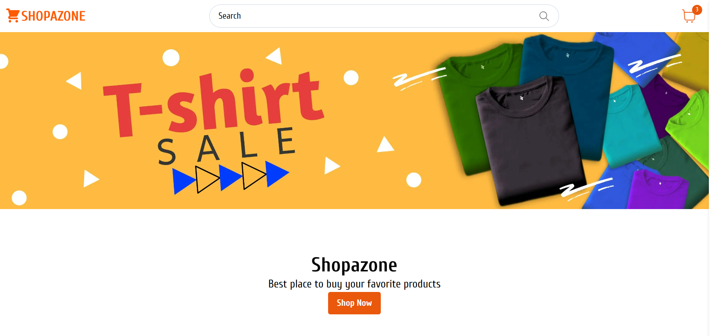
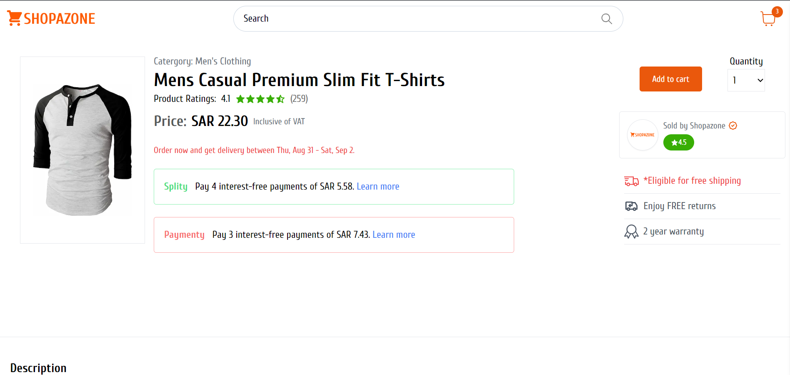
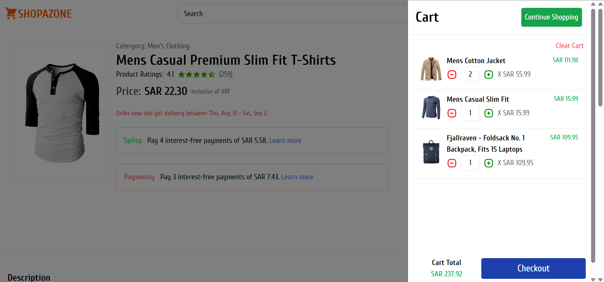
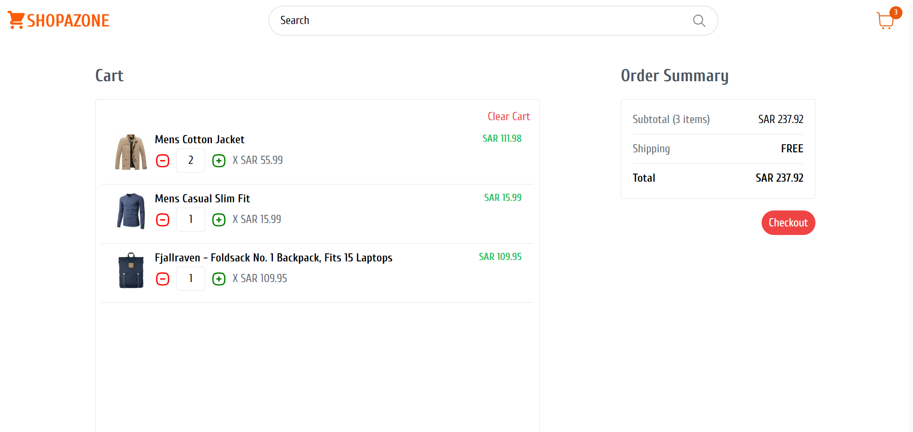

# Shopazone - Next.js E-commerce Store

 

Welcome to Shopazone, an experimental e-commerce project built with Next.js, TypeScript, Tailwind CSS, React Query (Transquery), and Redux. This project served as my exploration of the latest features and capabilities offered by Next.js and the modern React ecosystem.

## Project Overview

**Duration:** Just over a week

**Challenges:** While I aimed to keep this project small, it presented a few unexpected challenges. Debugging and solving some stubborn bugs took some time, but it was all part of the learning process.

## API Integration

Initially, I had plans to build my own API for this project, but I stumbled upon the [Fake Store API](https://fakestoreapi.com/docs), which provided the data I needed for products. This allowed me to focus on the frontend experience without worrying about backend development.

## Search Functionality

One notable feature I'm still refining is the search functionality. Currently, it's not fully optimized and responsive as it relies on searching through a JSON file. I'm aware that using a SQL database would be a more efficient solution for search, and it's something I plan to explore in future iterations.

## Screenshots

<!-- Replace these with links to your project screenshots -->

## Future Development

While this project served as a learning opportunity and a chance to experiment with Next.js, I have plans to enhance and refine it further. Here are some of the areas I'll be looking into:

- **Optimizing Search:** Implementing a more efficient search mechanism using a SQL database.
- **Improving UI/UX:** Enhancing the overall user interface and user experience.
- **Adding New Features:** Expanding the feature set and adding more functionality to make Shopazone even more user-friendly.

Feel free to explore the codebase and contribute to the project. Your feedback and contributions are highly appreciated!

Thank you for checking out Shopazone!
